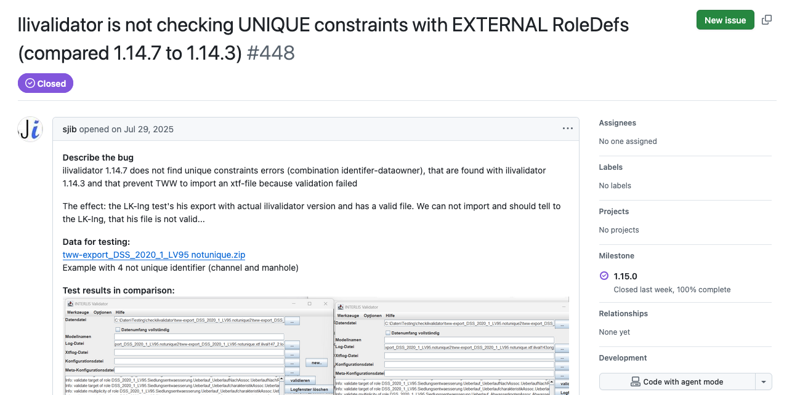
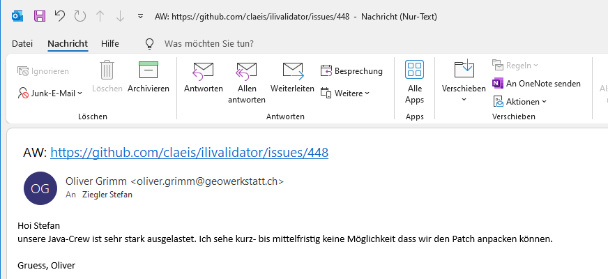
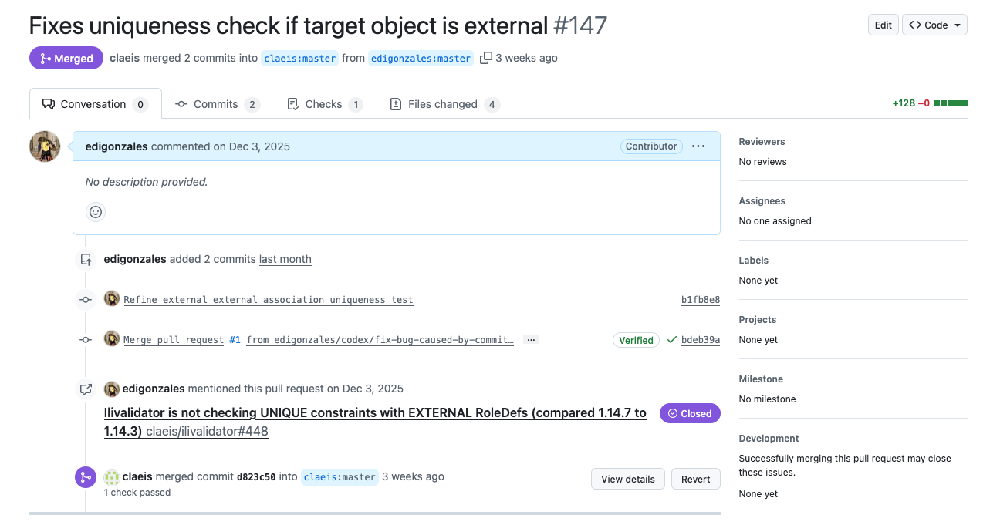
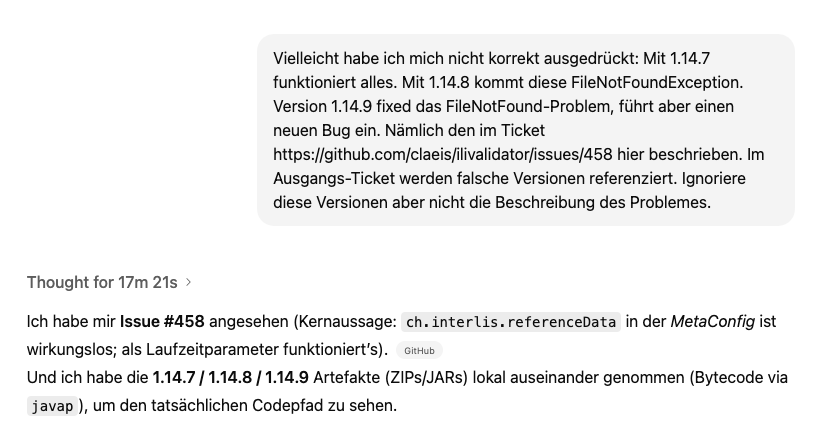
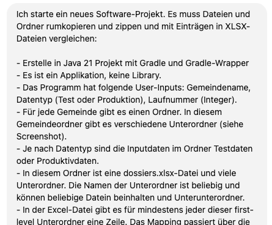
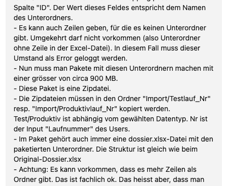
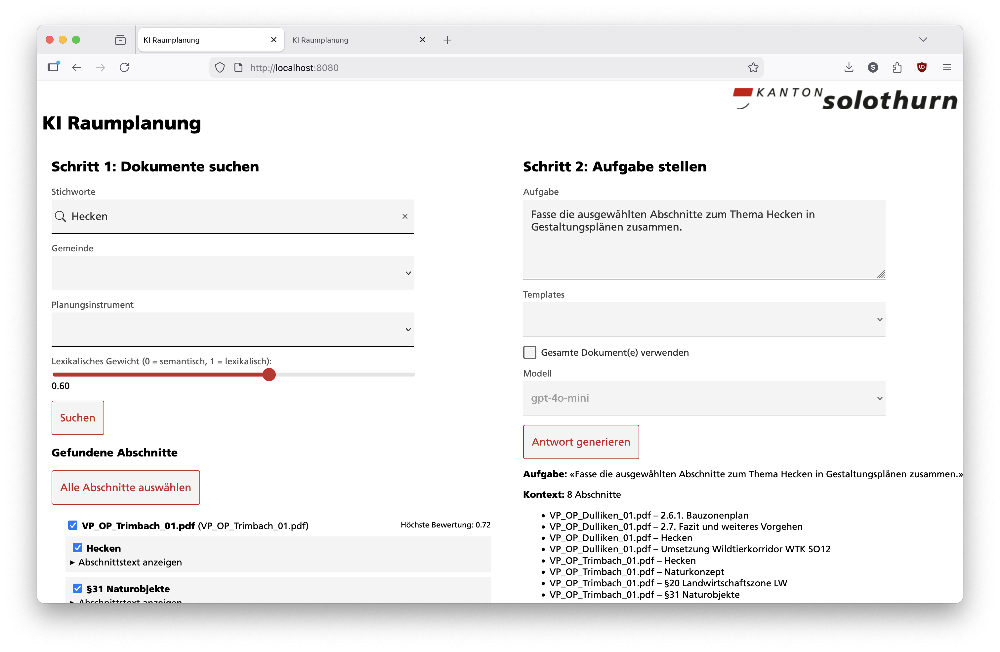
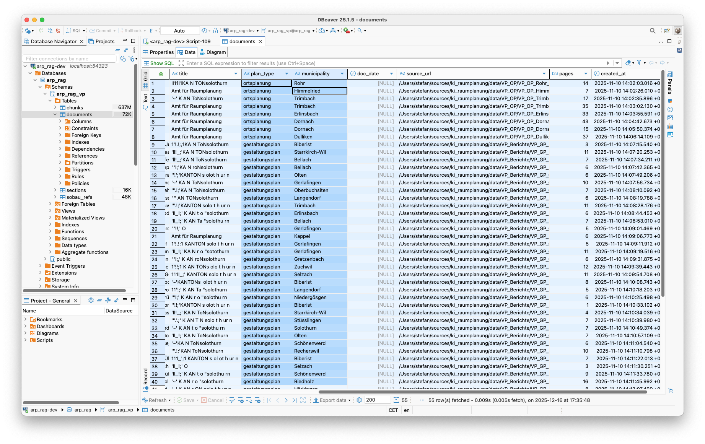
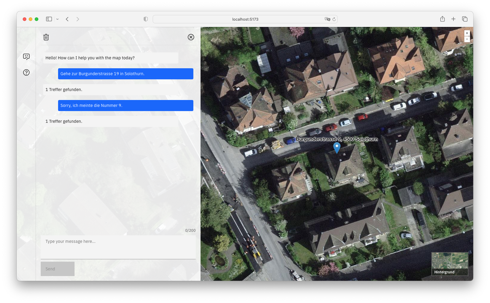

= KI: Beispiele aus dem AGI
//:author: Stefan Ziegler
:date: 2026-01-19
:revealjsdir: reveal.js
:revealjs_hash: true
:revealjs_slideNumber: true
:docinfo: shared
:icons: font
:customcss: my-overrides.css

== Codegenerierung

=== Bugfixing (1)

=== Bugfixing (1)

=== Bugfixing (1)

=== Bugfixing (2)

[.columns.is-vcentered]
=== Komplette Software 

[.column]
--

--
[.column]
--

--
[.column]
--
image::images/codegenerierung/software_part_3.png[]
--

== Wissensmanagement

=== Ausgangslage + Ziele
* Viel Wissen in vielen Dokumenten
* Wissensmanagement allgemein
* Textbausteine zu einem Thema erstellen lassen

=== Proof of Concept

=== Lessons learned

=== Metadaten

Metadaten verwenden! Können ggf. (auch mit KI) wiederhergestellt werden.

=== Datenformate

icon:smile-o[] Markdown/Asciidoc etc.

icon:meh-o[] DOCX

icon:frown-o[] PDF  

== Web GIS goes KI

=== Vorteile

- Natürliche Sprache
- Schreibfehler